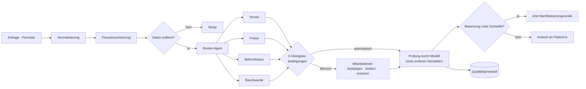

# Architektur / Architecture

```mermaid
flowchart LR
  F[Anfrage · Formular] --> N[Normalisierung]
  N --> P[Pseudonymisierung]
  P --> G{Daten entfernt?}
  G -- nein --> STOP[Stopp]
  G -- ja --> R[Router-Agent]
  R --> T[Termin] & PR[Preise] & B[Befundstatus] & K[Beschwerde]
  T & PR & B & K --> H{6 Übergabe-<br/>bedingungen}
  H -- automatisch --> E
  H -- Mensch --> M[Mitarbeitende:<br/>bestätigen · ändern · ersetzen]:::human
  M --> E[Prüfung durch Modell<br/>eines anderen Herstellers]
  E --> Q{Bewertung unter Schwelle?}
  Q -- ja --> NB[eine Nachbesserungsrunde]:::human
  Q -- nein --> OUT[Antwort an Patient:in]
  E --> LOG[(Qualitätsprotokoll)]
  classDef human stroke-dasharray: 5 5
```
